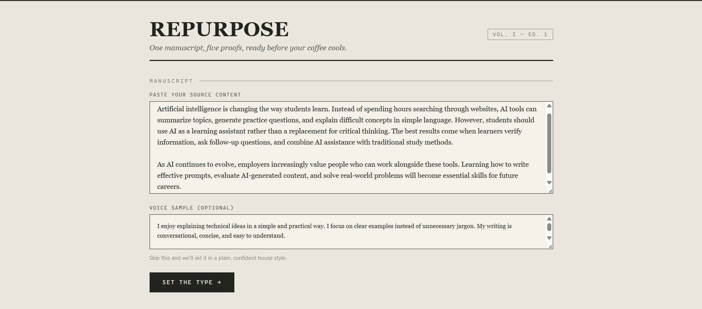
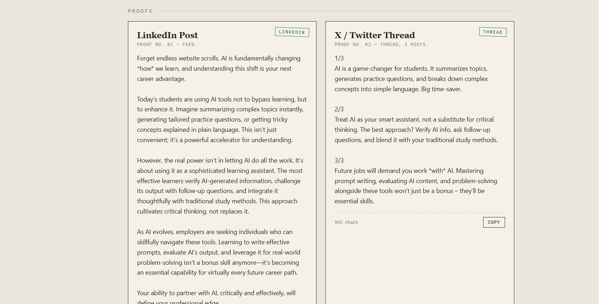

# Repurpose

AI-powered content repurposing tool that transforms a single manuscript into platform-specific content using Google Gemini.

---

## Features

- ✨ Generate a LinkedIn post
- 🧵 Generate a 3-post X (Twitter) thread
- 📸 Generate an Instagram caption
- 📧 Generate a newsletter blurb
- ▶️ Generate a YouTube description
- 🎯 Optional voice matching using writing samples
- 📋 One-click copy for every generated output
- ⚡ Fast AI generation powered by Google Gemini

---

## Tech Stack

### Frontend
- HTML5
- CSS3
- JavaScript

### Backend
- Node.js
- Express.js

### AI
- Google Gemini API

---

## Screenshots

### Home Page



### Generated Outputs



---

## Installation

Clone the repository

```bash
git clone https://github.com/KalviinJoshua/Repurpose.git
```

Open the project

```bash
cd Repurpose
```

Install dependencies

```bash
npm install
```

Create a `.env` file

```env
GEMINI_API_KEY=YOUR_GEMINI_API_KEY
```

Run the project

```bash
node server.js
```

Open

```
http://localhost:3000
```

---

## Project Structure

```
Repurpose/
│
├── public/
│   └── index.html
│
├── server.js
├── package.json
├── .env.example
└── README.md
```

---

## Future Improvements

- Dark mode
- Download outputs as text
- PDF export
- Multiple AI models
- User authentication
- History of generated content

---

## Author

**Kalviin Joshua**

B.Tech Computer Science Engineering Student

SRM Institute of Science and Technology

---

## License

This project is licensed under the MIT License.